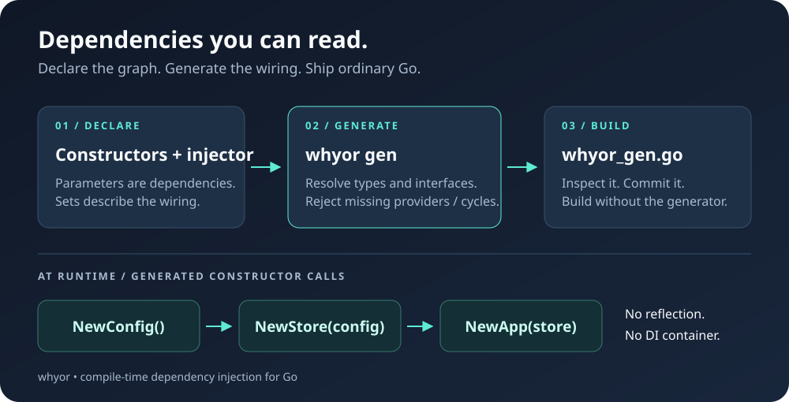

<div align="center">

# whyor

### Declare the graph. Generate the wiring. Ship ordinary Go.

Compile-time dependency injection for Go, inspired by Google Wire.

[](https://github.com/Medzoner/whyor/actions/workflows/ci.yml)
[](https://github.com/Medzoner/whyor/releases)
[](go.mod)
[](https://pkg.go.dev/github.com/Medzoner/whyor)
[](LICENSE)

**No runtime DI container · No reflection · Inspectable generated code**

[Quick start](#quick-start) · [API](#api-at-a-glance) · [CLI](#cli) · [From Wire](docs/migrating-from-wire.md)

</div>



## Why whyor?

Your constructors already describe their dependencies. whyor connects them and
writes the initialization code you would otherwise maintain by hand.

- **Plain Go output.** Review, debug and commit the generated injector.
- **Explicit dependencies.** Constructors stay ordinary functions, independent of the generator.
- **Early feedback.** Generation rejects missing providers, duplicate bindings and dependency cycles.
- **Less boilerplate.** Reusable sets, generic bindings, struct construction and field extraction.
- **Beyond basic wiring.** Slice providers, automatic interface bindings, `Close()` cleanup and graph exports.

Google Wire was [archived in August 2025](https://github.com/google/wire).
whyor explores a new API for the same compile-time approach; it is **not a
drop-in replacement or an official continuation**. The project is pre-1.0:
expect API changes and check the limitations below before migrating.

## Install

```sh
go install github.com/Medzoner/whyor/cmd/whyor@latest
```

In your application module:

```sh
go get github.com/Medzoner/whyor@latest
```

Current releases require **Go 1.27.1+**. Build the generator with a Go version
at least as recent as your application's version. Add `$(go env GOPATH)/bin`
to your `PATH` if `whyor` is not found, or use your configured `GOBIN`.

## Quick start

The following three files form a complete, runnable example inside a Go module.

### 1. Write ordinary constructors

**`app.go`**

```go
package main

type Config struct{ Name string }

type Store interface{ Message() string }

type MemoryStore struct{ cfg *Config }

func (s *MemoryStore) Message() string { return "Hello, " + s.cfg.Name }

func NewConfig(name string) *Config { return &Config{Name: name} }
func NewStore(cfg *Config) *MemoryStore { return &MemoryStore{cfg: cfg} }

type App struct{ Store Store }

func NewApp(store Store) *App { return &App{Store: store} }
```

### 2. Declare the injector

**`wire.go`** — the filename is a convention; the build tag is what matters.

```go
//go:build whyor

package main

import "github.com/Medzoner/whyor"

var Providers = whyor.Set(
	NewConfig,
	NewStore,
	whyor.Bind[Store, *MemoryStore](),
)

func InitApp(name string) *App {
	panic(whyor.Build(Providers, NewApp))
}
```

Injector parameters are supplied by the caller. Everything else comes from
the providers. The `panic` is a declaration marker, **not runtime wiring**:
this file is excluded from a normal build.

### 3. Generate and run

**`main.go`**

```go
package main

import "fmt"

func main() {
	fmt.Println(InitApp("Go").Store.Message())
}
```

```sh
whyor gen .
go run .
# Hello, Go
```

The generated **`whyor_gen.go`** contains regular constructor calls:

```go
// Code generated by whyor. DO NOT EDIT.

//go:build !whyor

package main

func InitApp(name string) *App {
	v1 := NewConfig(name)
	v2 := NewStore(v1)
	v3 := NewApp(v2)
	return v3
}
```

**Commit the generated file.** Normal builds no longer need to run whyor.
Keep constructors in files without the `whyor` build tag: the generator does
not copy their definitions into the generated file.

## API at a glance

| Declaration | Purpose |
|---|---|
| `Build(...)` | Declare an injector with `panic(whyor.Build(...))`. |
| `Set(...)` | Group providers and options into a reusable set. |
| `Bind[I, T]()` | Supply interface `I` using a provider for concrete type `T`. |
| `Value[T](v)` | Supply an expression as a dependency of type `T`. |
| `Struct[T](fields...)` | Construct `T` and/or `*T` from field dependencies. |
| `FieldsOf[T]("A", "B")` | Expose named fields of a provided struct or pointer. |
| `Many[T](providers...)` | Construct a `[]T` from multiple providers. |
| `AutoBind[T]()` | Select `T` for requested interfaces it implements, when unambiguous. |
| `Closer[T]()` | Register `T.Close()` as cleanup for a provider without its own cleanup. |

### Collect implementations into a slice

```go
whyor.Many[Handler](NewUsersHandler, NewOrdersHandler)
// Provides []Handler in declaration order.
```

`Many` elements are not automatically registered as standalone dependencies.
If another constructor needs `*UsersHandler`, register its provider outside
`Many` too. A shared function provider is called once per injector.

### Bind interfaces automatically

```go
whyor.Set(NewPostgres, whyor.AutoBind[*Postgres]())
```

The concrete type still needs a provider. Automatic binding succeeds only
when exactly one registered `AutoBind` type implements the requested interface.
Use explicit `Bind` declarations when you want to control the choice.

### Construct structs and expose configuration fields

```go
whyor.Struct[Dependencies]()              // exported fields, except whyor:"-"
whyor.Struct[Dependencies]("Store", "Log") // only the named fields
whyor.FieldsOf[*Config]("Addr", "Port")   // provides the field types
```

`Struct[T]()` and `Struct[T]("*")` use the same default field selection.
If both `T` and `*T` are requested, they are constructed independently.
Fields exposed by `FieldsOf` must have distinct types, or they collide as providers.

Types are matched using Go's identity rules, including aliases nested in
signatures, structs and generic type arguments. Distinct defined types are
not merged, even if their underlying types match.

## Errors and cleanup

Providers and injectors support these result shapes:

```go
T
(T, error)
(T, func())
(T, func(), error)
```

If a reachable provider returns an error or cleanup, the injector must expose
the corresponding result too. Cleanups run in **reverse acquisition order**:
on success the caller receives a combined cleanup; on a provider error,
previously acquired resources are released before returning.

```go
// Inside a function that returns an error:
app, cleanup, err := InitApp("production")
if err != nil {
	return err
}
defer cleanup()
_ = app // Use the initialized application.
```

See [examples/basic](examples/basic) for a complete cleanup-enabled injector.
On error, each provider must release resources it acquired internally; the
injector only calls cleanups returned by previously successful providers.

For types that already have `Close()` or `Close() error`, add
`whyor.Closer[*DB]()`. The injector must return `func()`; a provider's explicit
cleanup takes precedence. **Errors returned by `Close()` are discarded** by
the generated cleanup. Cleanup functions should be non-nil on successful construction.

## CLI

Package patterns default to `./...`.

| Command | Use |
|---|---|
| `whyor gen ./...` | Write changed `whyor_gen.go` files. |
| `whyor gen -w ./...` | Generate initially, then watch Go files under the current directory. |
| `whyor check ./...` | Exit nonzero if generated code is stale or generation fails. |
| `whyor unused ./...` | List function providers declared in injectors but never called by any analyzed injector; exit nonzero if found. |
| `whyor show ./...` | Display dependency trees. |
| `whyor show -f mermaid ./...` | Export Mermaid graphs. |
| `whyor show -f dot ./...` | Export Graphviz graphs. |
| `whyor init ./internal/app` | Create a declaration skeleton without overwriting `wire.go`. |

### Understand your dependency graph

```text
InitApp
└── *App [NewApp]
    └── Store [Bind]
        └── *PG [NewPG]
            └── *Config [NewConfig]
                └── string [parameter dsn]
```

Repeated dependencies are marked `(*)` in the tree. Graph output is useful for
code reviews and architecture documentation. With Graphviz installed:

```sh
whyor show -f dot ./internal/app | dot -Tsvg > dependencies.svg
```

### Automate generation

Place the directive in a file **without** the `whyor` tag:

```go
//go:generate whyor gen .
```

```sh
go generate ./...
```

For CI, after installing the generator:

```sh
go test ./...
whyor check ./...
whyor unused ./...
```

`check` verifies freshness; it does not replace compilation and tests.

## Migrating from Wire

The model is familiar; the declaration API is different.

| Wire | whyor |
|---|---|
| `wire.NewSet(...)` | `whyor.Set(...)` |
| `wire.Bind(new(Store), new(*PG))` | `whyor.Bind[Store, *PG]()` |
| `wire.Struct(new(Deps), "*")` | `whyor.Struct[Deps]()` |
| `wire.FieldsOf(new(*Config), "Addr")` | `whyor.FieldsOf[*Config]("Addr")` |
| `//go:build wireinject` | `//go:build whyor` |
| `wire_gen.go` | `whyor_gen.go` |

whyor also offers `Many`, `AutoBind`, `Closer`, watch mode and Mermaid/Graphviz
exports. It does not claim full compatibility with Wire.

Read the [migration guide](docs/migrating-from-wire.md) for the checklist
and behavior differences.

## Examples

| Example | Demonstrates |
|---|---|
| [basic](examples/basic) | Sets, interface binding, cleanup and `go generate`. |
| [features](examples/features) | `Many`, `AutoBind` and `Closer`. |
| [structs](examples/structs) | Selected struct fields and `FieldsOf`. |
| [alias](examples/alias) | Matching an alias and its target type. |
| [typeidentity](examples/typeidentity) | Nested aliases, equivalent interfaces, instantiated generic types and shared dependencies. |
| [edge](examples/edge) | Import-name collisions, values and error-path cleanup. |

## Current limitations

- Providers and injectors must be plain, non-generic, non-variadic functions.
- Injectors must contain the declaration `panic(whyor.Build(...))` as their only statement.
- Generated code calls providers; it does not copy helpers from tagged files.
- `Many` does not accept nested `Many`, `Bind`, `AutoBind` or `Closer` declarations.
- Dependency resolution is type-based: multiple providers of the same type conflict outside `Many`.
- Watch mode polls every 500 ms under the current directory and excludes generated Go files, `vendor`, `testdata` and hidden directories.
- Graph exports and diagnostics are evolving alongside the pre-1.0 API.

## Contributing

```sh
git clone https://github.com/Medzoner/whyor.git
cd whyor
make install
make check
```

Tests include versioned generated examples, invalid declaration fixtures,
graph output assertions and reproducible randomized provider graphs.
For a change to generation behavior, add an example or regression test and
regenerate the expected output.

Found a bug or have a proposal? [Open an issue](https://github.com/Medzoner/whyor/issues).

## License

[MIT](LICENSE).
