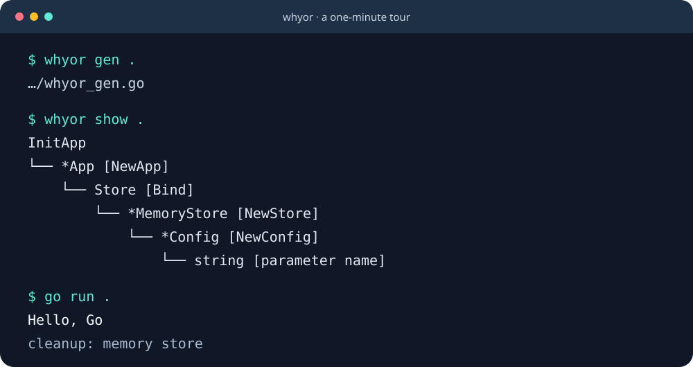

# The 60-second whyor demo

**Ordinary constructors → a declaration → generated Go → a visible graph → a running app.**

This is an executable demonstration, not a simulated benchmark. The store is
in memory and its cleanup is illustrative; no database, credentials or private
dependency is needed.



The preview above is an SVG rendering of command output, not a video recording.

## Run it

From a clone of the repository, with Go 1.27.1+:

```sh
bash docs/demo/run.sh
```

Preparation builds the CLI from the checkout. The script then presents five
screens, pausing 12 seconds on each (approximately 60–90 seconds with commands).
Cold module downloads/builds happen during preparation and are not a speed claim.

For a fast verification run:

```sh
DEMO_PAUSE=0 bash docs/demo/run.sh
```

The script creates its own temporary module and uses an explicit local replace
to exercise this checkout. It deletes only that temporary workspace on exit,
and does not modify the versioned examples. This local-demo replace is not an
application installation requirement.

## Try the example directly

```sh
go run ./cmd/whyor gen ./examples/showcase
go run ./examples/showcase
```

Expected application output:

```text
Hello, Go
cleanup: memory store
```

## Recording storyboard

| Screen | What the viewer sees | Suggested narration |
|---|---|---|
| 1 | Plain constructor functions | “Your constructors already describe their dependencies.” |
| 2 | `Set`, `Bind`, `Build` | “Declare the composition separately; normal builds exclude this file.” |
| 3 | `whyor_gen.go` | “The output is regular Go. Read it, debug it, commit it.” |
| 4 | Dependency tree and JSON export | “You can inspect the graph without reverse-engineering the injector.” |
| 5 | Hello message, cleanup, tests | “The application runs without a runtime DI container.” |

Record a terminal at about 100 columns × 35 rows. The script clears the screen
only when stdout is a terminal. If you already use asciinema, for example:

```sh
asciinema rec -c 'bash docs/demo/run.sh' whyor-demo.cast
```

That command requires a separate asciinema installation. No video recording
tool is required to run the demo; no published recording is claimed here.

## Show the migration, not just the new API

See [the short Wire migration example](../wire-migration-example.md).
The declaration changes, but the constructors and caller stay the same.
